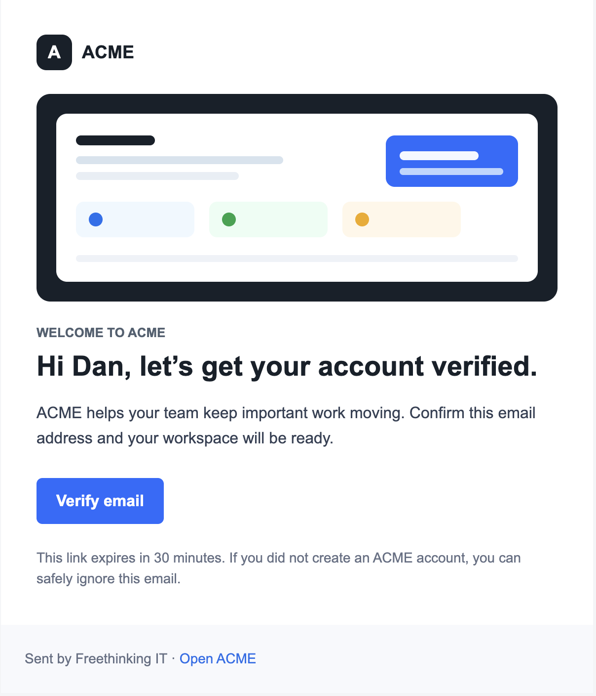
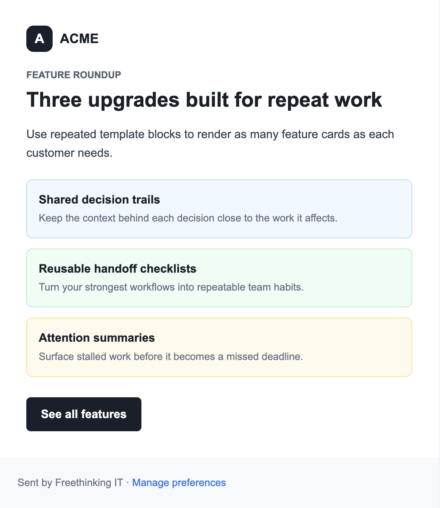
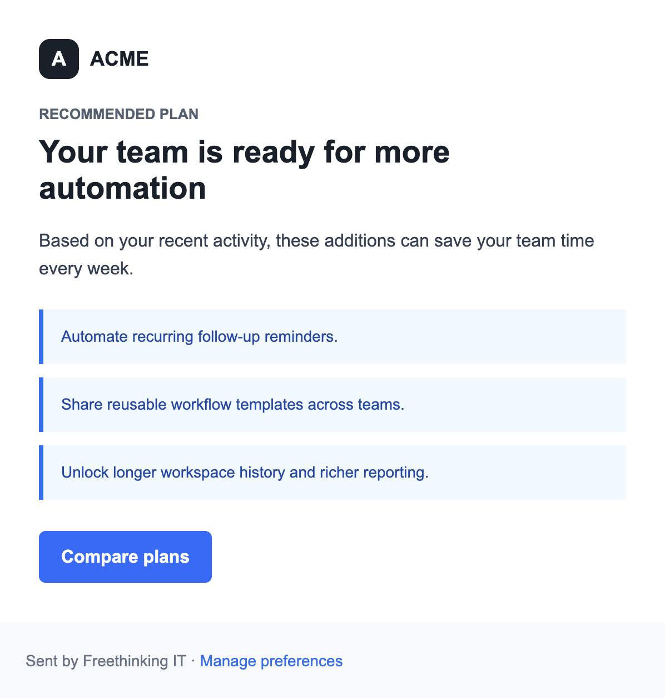
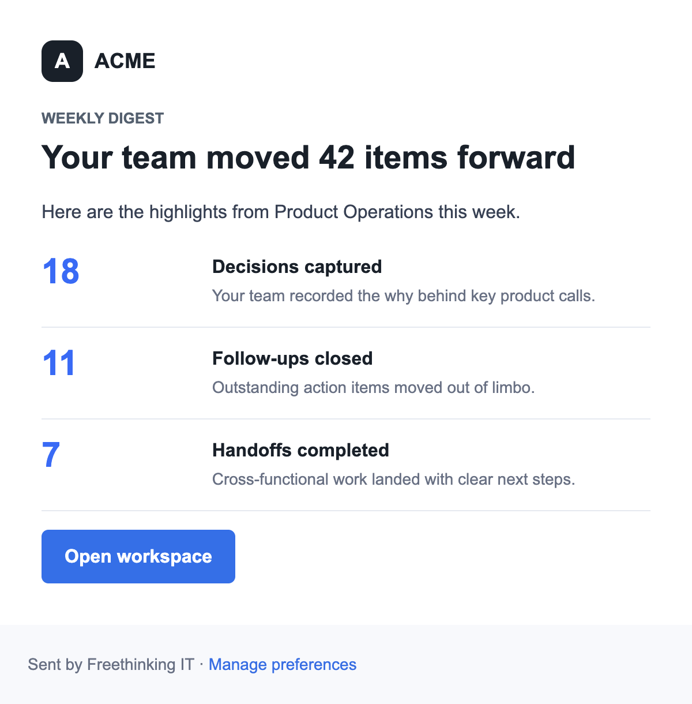
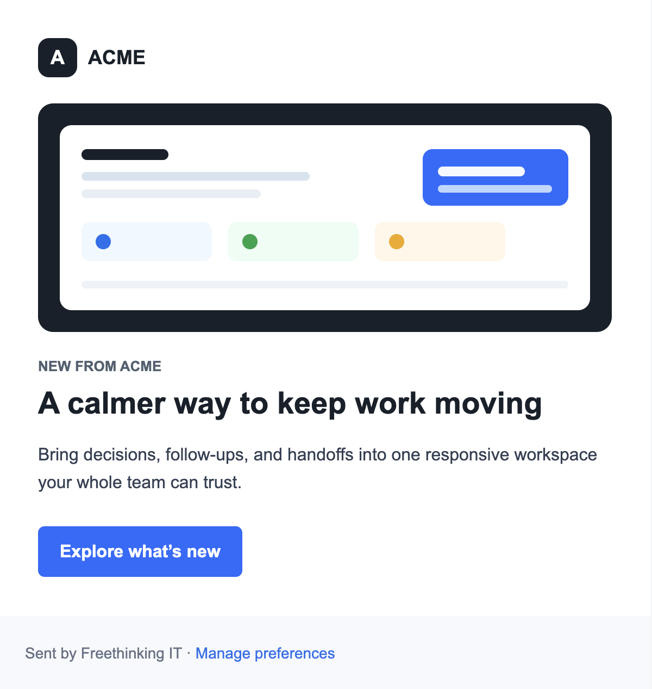

# Inline Email

[](https://www.npmjs.com/package/inline-email)
[](https://www.npmjs.com/package/inline-email)
[](https://github.com/freethinkingit/inline-email/actions/workflows/ci.yml)
[](https://github.com/freethinkingit/inline-email/actions/workflows/release.yml)
[](LICENSE.md)
[](package.json)

Modern email template compilation and rendering for safe HTML email.

`inline-email` turns HTML/CSS into an email-safe compiled template. Dynamic values are rendered later without running full CSS inlining for every send.



Build responsive transactional and product emails from small HTML building blocks, plain CSS, and simple runtime data.

```html
<email>
  <preview>{{featureCount}} ACME features your team can start using this week.</preview>
  <container>
    <section padding="36">
      <brand mark="A">ACME</brand>
      {{#features}}
      <panel tone="{{tone}}">
        <p>{{title}}</p>
        <p>{{description}}</p>
      </panel>
      <spacer size="14" />
      {{/features}}
      <button href="{{featuresUrl}}">See all features</button>
    </section>
    <footer>Sent by Freethinking IT</footer>
  </container>
</email>
```

## Examples

| Welcome + verify | Product launch |
| --- | --- |
|  |  |

| Usage digest | Upgrade offer |
| --- | --- |
|  |  |

The repo includes rendered examples for auth, onboarding, product marketing, usage digests, and upgrade offers. Run `npm run examples` to regenerate them into `examples/out`.

## Status

The package targets Node.js 20, 22, and 24.

## Quality

- [CI workflow](https://github.com/freethinkingit/inline-email/actions/workflows/ci.yml) runs install, high-severity audit, build, tests, and package dry-run on Node.js 20, 22, and 24.
- [Release workflow](https://github.com/freethinkingit/inline-email/actions/workflows/release.yml) publishes version tags to npm with provenance and attaches the package tarball to a GitHub Release.
- Test coverage is focused in [`test/`](test/) across the template renderer, responsive layout compiler, compile/render API, and CLI argument handling.
- [Migration guide](https://github.com/freethinkingit/inline-email/wiki/Migrating-to-v3) covers the v2 to v3 API and CLI changes.
- Local checks:

```sh
npm audit --audit-level=high
npm run build
npm test
npm pack --dry-run
```

## Installation

Install from npm:

```sh
npm install inline-email
```

## Library API

Compile the template once at build/deploy time or cold start:

```ts
import { compileEmailTemplate } from 'inline-email';

const compiled = await compileEmailTemplate({
  subject: 'Welcome to ACME, {{firstName}}',
  html,
  css,
  text: 'Welcome to ACME, {{firstName}}'
});
```

Render dynamic data at email-send time:

```ts
const email = compiled.render({
  data: {
    firstName: 'Dan',
    appUrl: 'https://app.acme.example',
    slots: {
      summary: '<p>Your account was approved.</p>'
    }
  }
});

// { subject, html, text }
```

One-shot rendering is also available:

```ts
import { renderEmail } from 'inline-email';

const email = await renderEmail({
  template: {
    subject: 'Welcome, {{firstName}}',
    html: '<p>Hello {{firstName}}</p>'
  },
  data: {
    firstName: 'Dan'
  }
});
```

## Template Syntax

Normal variables are escaped by default:

```html
<p>Hello {{firstName}}</p>
```

Repeated blocks render arrays:

```html
<ul>
  {{#items}}<li>{{label}}</li>{{/items}}
</ul>
```

Trusted HTML slots must be explicit:

```html
<section>{{slot:summary}}</section>
```

Slots are supplied separately via `data.slots`, which keeps trusted HTML injection intentional instead of relying on accidental unescaped variables.

## Responsive Layout Tags

The compiler includes a small Inky-like responsive layout layer. These reusable tags compile to conservative table markup before CSS is inlined:

```html
<email>
  <preview>Welcome to ACME</preview>
  <container>
    <section padding="32">
      <brand href="{{brandUrl}}" mark="A">ACME</brand>
      <hero-image src="{{heroImageUrl}}" alt="ACME preview" width="528" />
      <spacer size="24" />
      <columns>
        <column width="50%">
          <p>Hello {{firstName}}</p>
        </column>
        <column width="50%">
          <button href="{{appUrl}}">Open ACME</button>
        </column>
      </columns>
      <spacer size="24" />
      <alert tone="warning">This link expires in {{expiresIn}}.</alert>
    </section>
    <footer>Sent by Freethinking IT</footer>
  </container>
</email>
```

Supported tags:

```text
<email>       Full document wrapper with mobile media rules.
<preview>     Hidden inbox preview text.
<container>   Centered 600px email body.
<section>     Padded content block.
<columns>     Table row for columns.
<column>      Responsive column that stacks on small screens.
<button>      Table-based CTA button.
<brand>       Small wordmark/header lockup.
<image>       Responsive email-safe image.
<hero-image>  Wide responsive image with rounded corners.
<spacer>      Email-safe vertical spacing.
<divider>     Horizontal rule using table markup.
<otp>         One-time code display block.
<alert>       Inline warning/info/success/danger notice.
<panel>       Bordered content panel.
<footer>      Muted footer section.
```

Responsive layout tags are enabled by default. Disable them with `responsive: false` if you want to pass through raw HTML unchanged.

### Vanilla Tones

`<alert>` and `<panel>` include a small vanilla tone set:

```html
<alert tone="warning">This link expires soon.</alert>
<panel tone="success">Your workspace is ready.</panel>
```

Supported tones are `neutral`, `info`, `success`, `warning`, and `danger`.

You can render with only data:

```ts
compiled.render({
  data: {
    tone: 'info'
  }
});
```

Or override tone colors for a brand:

```ts
compiled.render({
  data,
  style: {
    tones: {
      info: {
        background: '#eff8ff',
        border: '#b2ddff',
        text: '#1849a9',
        accent: '#1570ef'
      }
    }
  }
});
```

### Image-Based Open Analytics

`inline-email` does not create a standalone hidden tracker. For open/load analytics, use normal images with tracking parameters or route useful image URLs through your own image proxy:

```html
<hero-image
  src="https://images.example.com/open/welcome.png?messageId={{messageId}}&recipient={{recipientId}}"
  alt="Welcome preview"
  width="528"
/>
```

That keeps analytics tied to useful email assets such as logos, hero images, and product screenshots instead of relying on a hidden request that many clients block. Your sending app owns consent, disclosure, retention, and analytics handling.

## Compile Transforms

For layout syntax or local experiments, pass a compile-stage `transform`. It runs before CSS inlining and before runtime values are rendered:

```ts
const compiled = await compileEmailTemplate({
  html,
  css,
  transform: (source) => renderResponsiveLayout(source)
});
```

This is where product-specific helpers can grow without coupling the package to Inky, MJML, React Email, or any other layout framework.

## CLI

The CLI remains available as `inline-email`:

```sh
inline-email input.html
inline-email input.html --out output.html
inline-email --css style.css input.html
```

Supported options:

```text
--html <file>          Input HTML file. A positional input file is also supported.
--css <files...>       CSS files to inline.
--out, -o <file>       Write output to a file instead of stdout.
--noInlineImages       Disable image web resource inlining.
--force, -f            Overwrite the output file.
--help, -h             Show help text.
```

## Development

```sh
npm install
npm run build
npm test
```

## Release

Releases publish to npm and create a GitHub Release. Push a version tag that matches `package.json`:

```sh
git tag v3.0.0
git push origin v3.0.0
```

GitHub Actions runs audit, tests, build, package verification, publishes to npm with provenance, and creates a GitHub Release with the package tarball attached.

Before the first automated release, configure npm Trusted Publishing for this repository and the `Release` workflow. For a one-time manual first publish, run:

```sh
npm publish
```

## What This Does Not Do

`inline-email` does not validate that your markup uses only email-safe HTML tags, and it does not replace unsafe tags for you.

## License

[MIT](LICENSE.md)
